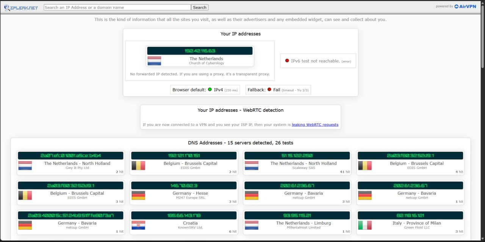
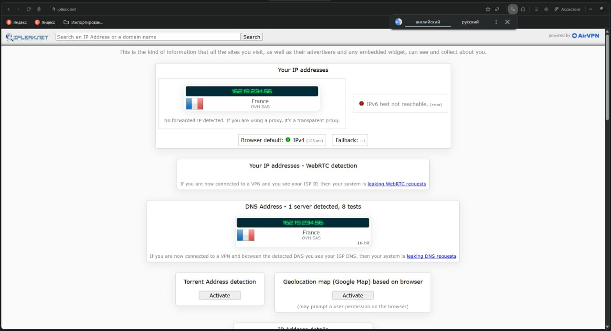

# 🛡️ OASIS Secure VPN

### Максимальная анонимность в один клик. Windows.

**Твой реальный IP, DNS и цифровой отпечаток — полностью скрыты.**

&nbsp;

---

## Что это

**OASIS Secure VPN** — desktop-приложение для Windows, которое делает тебя невидимым в сети.
Один клик — и весь трафик уходит через защищённый протокол **OASIS Secure**, твой настоящий
IP-адрес подменяется, DNS шифруется, а утечки (WebRTC, IPv6, DNS) блокируются автоматически.

Никаких логов. Никакой регистрации по почте или телефону. Вход по уникальному ID устройства.

---

## ✨ Возможности

| | Функция | Что даёт |
|---|---|---|
| 🌍 | **Смена IP-адреса** | Твой реальный IP скрыт, сайты видят другую страну |
| 🔒 | **Протокол OASIS Secure** | Многослойное шифрование трафика |
| 🧅 | **Шифрованный DNS** | DNS-запросы не видит ни провайдер, ни кто-либо ещё |
| 🚫 | **Kill Switch** | Обрыв соединения = мгновенная блокировка трафика, IP не утечёт |
| 🛑 | **Защита от утечек** | WebRTC и IPv6 заблокированы — реальный IP не проступит |
| 🎭 | **Маскировка MAC-адреса** | Аппаратный отпечаток устройства подменяется на случайный |
| 🔑 | **Вход по ID устройства** | Без email, без пароля, без слежки |
| ⚡ | **Смена цепочки в один клик** | Новый маршрут и новый IP когда захочешь |
| 🖤 | **Чистый минималистичный интерфейс** | Ничего лишнего |

---

## 🔬 Проверка на утечки

Ниже — сравнение теста на [ipleak.net](https://ipleak.net). Слева OASIS, справа — типичный
коммерческий VPN.

| OASIS Secure VPN | Обычный VPN |
|:---:|:---:|
|  |  |
| Реальный IP скрыт · распределённый DNS · без WebRTC/IPv6-утечек | Один резолвер · единый выход |

> Реальный IP-адрес и DNS провайдера **не видны** ни на одном из тестов. Полная анонимность.

---

## 💳 Тарифы

| План | Срок | Что входит |
|---|---|---|
| **Пробный** | несколько дней | Полный доступ, попробовать |
| **Месяц** | 30 дней | Все функции |
| **Полгода** | 180 дней | Все функции, выгоднее |
| **Год** | 365 дней | Максимальная выгода |

Актуальные цены и способы оплаты — в боте 👇

---

## 🛒 Как купить

1. Открой **[@cloverhub_bot](https://t.me/cloverhub_bot)** в Telegram
2. Нажми **/start** и выбери тариф
3. Оплати удобным способом
4. Скачай приложение, запусти **от имени администратора**
5. Скопируй свой **ID устройства** с экрана входа и отправь боту
6. Получи лицензию → положи рядом с приложением → **Войти**

Готово. Один клик «Подключить» — и ты анонимен.

### 👉 [Купить доступ — @cloverhub_bot](https://t.me/cloverhub_bot)

---

## 💻 Требования

- Windows 10 или 11 (64-bit)
- Запуск от имени администратора (нужно для защиты трафика на уровне системы)
- ~150 МБ на диске

---

## ❓ FAQ

**Ведёте ли вы логи?**
Нет. Приложение работает локально, аккаунтов и почты нет — привязка только к ID устройства.

**Это законно?**
Приложение — инструмент приватности. Ответственность за использование лежит на пользователе,
соблюдай законы своей страны.

**Могу ли я вернуть деньги?**
Для этого есть пробный период — попробуй перед покупкой.

**Не запускается / не подключается?**
Убедись, что запустил **от администратора**. Остальное — напиши в
[@cloverhub_bot](https://t.me/cloverhub_bot).

---

**OASIS Secure VPN** · Приватность без компромиссов

